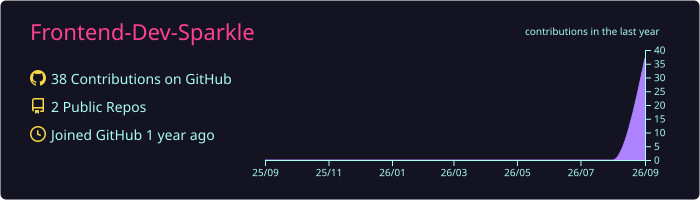
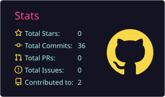

<p align="center">
  
</p>

<p align="center">
  <a href="https://prakashportfolio.netlify.app"></a>
  <a href="https://www.linkedin.com/in/prakash-r-40427020b"></a>
  <a href="mailto:prakashorg295@gmail.com"></a>
  
</p>

## 🦸 Origin story

By day I'm a **front-end engineer** with **5+ years** of experience building production **React** and **React Native** apps across logistics, marketplaces, construction-tech, and security.

My powers came from an unusual place. I started as a painter and won a **state-level art award**, then taught myself the front-end world, from HTML and CSS all the way to Redux, GraphQL, and native mobile. That's why I care about both how an app works and how it looks.

- 📱 I build **cross-platform mobile apps** with **offline-first sync** and **real-time updates**
- 🤖 I ship **AI-integrated features**, from auto-generated construction documents to AI-driven activity reports
- 🎨 I turn **Figma designs into pixel-accurate code**
- 🌱 I'm currently training in **backend and Python** on the way to full-stack, AI-focused products

## 🎯 Current mission: Humantic

A guard and security intelligence platform at **Multiplied AI**. I'm building the React Native app that captures field signals from guards on the ground: shift starts and ends, breaks, and photo, video, and audio notes tied to incidents.

| Challenge | How I'm solving it |
|---|---|
| Guards lose signal in the field | **Offline-first** capture with a background upload queue on **WatermelonDB** |
| The dashboard must update instantly | **Real-time UI** driven by backend events over **SSE** |
| Every signal must reach the backend | **GraphQL** queries and mutations backed by **PostgreSQL** |
| Thousands of signals need making sense of | Feeds **AI agents** that classify activity and auto-generate **daily reports** |

## 🛡️ Arsenal

<p align="center">
  
</p>

<p align="center">
  
</p>

## 💥 Missions completed

| Mission | What I built | Gear |
|---|---|---|
| 🏗️ **Mission Builder** | Led the front-end redesign of a web and mobile construction collaboration platform with multi-user tactical planning, built with one of the world's largest construction companies | React, React Native |
| 🤖 **AI Document Generation** | AI-generated step-by-step construction instructions and subcontractor scope documents, with editable variables for regeneration | React, Azure, MongoDB |
| 🚚 **FleetTrack for Prism Cement** | Live truck tracking with route paths, load status, and stop and idle detection on Google Maps | React, Redux, Firebase |
| 🛒 **Fleato Marketplace** | Buyer and seller flows and checkout for a token-rewards store that became an NFT marketplace, plus a React Native app I taught myself to build | React, React Native, PayPal |
| 🎨 **Fresh Arts** | Artist marketplace with live charity auctions. The Wonderball auction raised **$42,000** | React |
| 🧩 **Blue Tile Project** | Canvas tool for designing custom tile patterns that get ordered and made for real | JS Canvas |
| 🛢️ **ONGC** | React Native UI for an oil and gas field app | React Native |

## 🧪 Side quests

🦖 **Dino Run**, a colorized 3D-style Chrome dino clone in JS Canvas &nbsp;·&nbsp; 🌦️ **Weather App** with the OpenWeather API &nbsp;·&nbsp; ❌ **Tic-Tac-Toe** in React &nbsp;·&nbsp; ✅ **Todo App** on Firebase &nbsp;·&nbsp; 🎬 a portfolio site for a 3D animator friend

## 🗺️ The timeline

```text
2018   Web Dev Intern, Kumaran Institute of Technology
2020   BCA graduate, freeCodeCamp certified
       React Developer (Freelance), Ryde Consulting Service
2021   Software Engineer at Field Genie
         └─ Fleato: token and NFT marketplace
             └─ IOT++: fleet tracking and IoT
                 └─ Multiplied AI: AI documents and security intelligence
NOW    Building AI-powered, offline-first mobile products
```

## 📊 Hero stats

<p align="center">
  
</p>
<p align="center">
  
  
</p>
<p align="center">
  
</p>

<p align="center">
  
</p>

## 🏆 Honors

<p align="center">
  
  
  
  
</p>

<p align="center">🎨 <b>State-level 5th position, Painter Tilak Award (Art)</b></p>

<p align="center">
  
</p>
